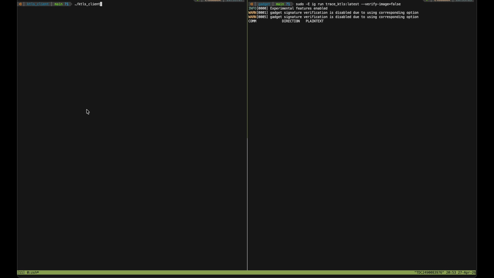

# trace-ktls



An [Inspektor Gadget](https://www.inspektor-gadget.io/) gadget that uses eBPF
to capture plaintext from [kTLS](https://docs.kernel.org/networking/tls.html)
connections, plus a minimal C client that demonstrates kTLS in action.

> **This is a proof-of-concept.** It accompanies a blog post about kTLS
> observability and is intended for educational and research purposes only.
> Do **not** run this in production. It hooks internal kernel functions that
> may change across kernel versions, captures sensitive plaintext data, and
> has not been hardened for security or performance.

---

## What is kTLS?

When an application enables kTLS (`setsockopt(SOL_TLS)`), the kernel's TLS
Upper Layer Protocol (ULP) takes over symmetric encryption and decryption.
The TLS handshake still happens in userspace (OpenSSL, GnuTLS, etc.), but
record protection moves into the kernel's TCP path.

This creates an interesting observability surface: because plaintext crosses
a formal kernel boundary, you can use eBPF to intercept it — without chasing
shifting offsets across OpenSSL, Go, or rustls versions.

## How the gadget works

The eBPF program hooks two kernel functions in the TLS ULP:

| Hook | Kernel function | What it captures |
|------|-----------------|------------------|
| kprobe | `tls_sw_sendmsg` | Plaintext **before** the kernel encrypts it (TX) |
| kprobe + kretprobe | `tls_sw_recvmsg` | Plaintext **after** the kernel decrypts it (RX) |

A Wasm operator (written in Go, compiled to WebAssembly) post-processes
events to add human-readable `direction` ("TX"/"RX") and `plaintext` fields.

## Repository layout

```
gadget/
  program.bpf.c    eBPF kprobes on the kernel TLS ULP
  go/program.go     Wasm operator (direction + plaintext fields)
  go/go.mod
  build.yaml        Tells ig to compile the Wasm operator
  gadget.yaml       Gadget metadata and field annotations
ktls_client/
  ktls_client.c     Minimal HTTPS client that enables kTLS via OpenSSL
  Makefile
```

## Requirements

| Component | Minimum | Tested with |
|-----------|---------|-------------|
| Linux kernel | 5.10+ with `CONFIG_TLS` | 6.17.0-1008-azure |
| Inspektor Gadget (`ig`) | 0.51+ | v0.51.1 |
| OpenSSL (for the demo) | 3.0+ with kTLS support | 3.0.13 |
| Docker (for `ig image build`) | any recent version | — |

## Build

### 1. Load the TLS kernel module

```bash
sudo modprobe tls
```

### 2. Build the gadget image

The build uses the Inspektor Gadget builder container (requires Docker):

```bash
cd gadget
sudo ig image build -t trace_ktls:latest .
```

### 3. Build the demo client

```bash
cd ktls_client
make
```

## Usage

Open **two** terminals.

### Terminal 1 — run the gadget

```bash
sudo -E ig run trace_ktls:latest \
  --verify-image=false
```

### Terminal 2 — run the demo client

```bash
cd ktls_client
./ktls_client
```

The client connects to `httpbin.org:443`, performs a TLS handshake with
`SSL_OP_ENABLE_KTLS`, and sends an HTTP GET request. If kTLS activates
successfully, you'll see output like:

```
┌─────────────────────────────────┐
│  kTLS TX: ✓ ACTIVE              │
│  kTLS RX: ✓ ACTIVE              │
│  Cipher:  ECDHE-RSA-AES128-GCM… │
│  Version: TLSv1.2                │
└─────────────────────────────────┘
```

Back in Terminal 1, the gadget captures the plaintext in real time:

```
COMM          PID   DIRECTION  LEN  PLAINTEXT
ktls_client   1234  TX          99  GET /get HTTP/1.1\r\nHost: httpbin.org…
ktls_client   1234  RX         225  HTTP/1.1 200 OK\r\nContent-Type: app…
```

### JSON output

For structured output (useful for scripting or piping to `jq`):

```bash
sudo IG_EXPERIMENTAL=true ig run trace_ktls:latest \
  --verify-image=false -o json
```

## Troubleshooting

| Symptom | Likely cause | Fix |
|---------|-------------|-----|
| kTLS TX/RX show "inactive" | Negotiated cipher not supported by kernel ULP, or OpenSSL built without kTLS | Check `cat /proc/net/tls_stat` — `TlsTxSw`/`TlsRxSw` should increment |
| No events in the gadget | TLS module not loaded | `sudo modprobe tls` and verify with `lsmod \| grep tls` |
| No `direction`/`plaintext` fields | Wasm operator not running | Ensure `IG_EXPERIMENTAL=true` is set |
| Gadget fails with signature error | Local-only image, not signed | Pass `--verify-image=false` |

## Disclaimers

- **Proof-of-concept only.** This gadget hooks internal kernel functions
  (`tls_sw_sendmsg`, `tls_sw_recvmsg`) that are not part of the stable
  kernel ABI and may change without notice between kernel versions.

- **Captures sensitive data.** The entire purpose of this tool is to read
  plaintext that is normally encrypted on the wire. Use it only in
  controlled environments where you have authorization to inspect traffic.

- **Not production-ready.** There is no filtering by PID, container, or
  namespace. Every kTLS connection on the host will be traced. The
  plaintext capture is limited to the first 256 bytes per event.

- **Kernel version dependent.** The `iov_iter` struct layout and `iter_type`
  enum values are read via BPF CO-RE, but the overall approach assumes
  the software TLS path (`tls_sw_*`). Hardware-offloaded kTLS
  (`tls_device_*`) is not covered.

## License

The eBPF program is licensed under GPL-2.0 (required for BPF helper access).
The demo client and Wasm operator follow the same license.
